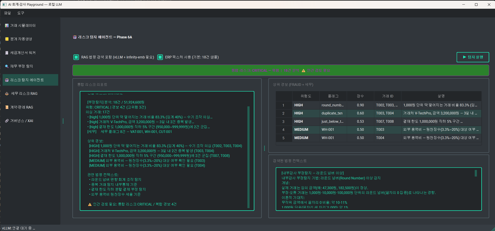
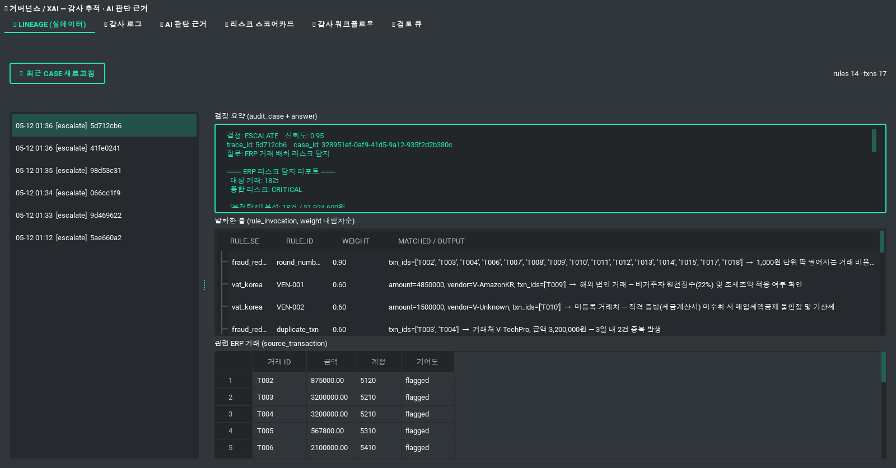
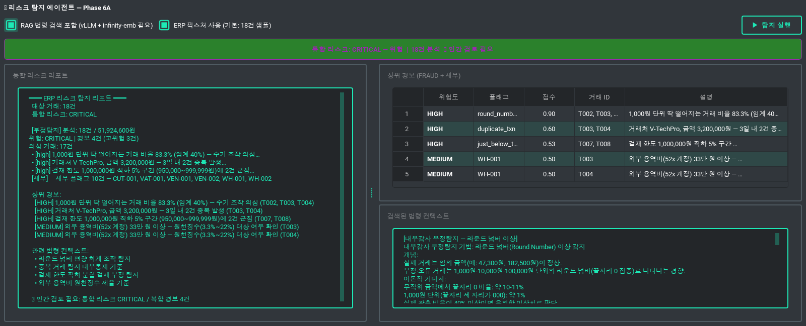
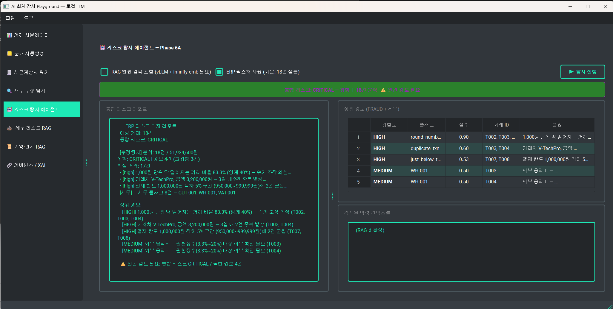

# ERP Risk Manage RAG Demo — Reliable AI Accounting & Audit

[](https://opensource.org/licenses/MIT)
[](https://www.python.org/downloads/release/python-3110/)
[](https://github.com/langchain-ai/langgraph)

**AI 가 만든 답을 사람이 검증할 수 있는가** 에 대한 기술적 해답.

본 프로젝트는 ERP 의 정형 데이터(재무·회계)와 법령·판례의 비정형 데이터를 결합하여, 모든 결정의 근거를 역추적(Lineage) 할 수 있는 **신뢰할 수 있는 AI 회계·감사 에이전트 시스템**입니다. 

344개의 테스트 케이스를 통과한 정밀 룰 엔진과 최신 BGE-M3 모델 기반의 하이브리드 RAG를 결합해, 실무에 적용 가능한 수준의 신뢰성을 목표로 구성했습니다.

---

## 📺 Demo Scenarios

| 통합 리스크 리포트 (Hybrid RAG) | 의사결정 추적 (XAI Lineage) |
|:---:|:---:|
|  |  |
| *부정 탐지 룰과 RAG 추론을 결합한 통합 리스크 점수 산출* | *6개 테이블 리니지 구조로 AI 답변의 모든 근거 역추적* |

| 수익인식 룰엔진 & 분개 생성 | AI 감사 대시보드 |
|:---:|:---:|
|  |  |
| *K-IFRS 1115 5단계 로직 기반의 결정론적 룰 처리* | *실시간 거래 시뮬레이션 및 감사 워크플로우 제어* |

---

## 🎯 Problem & Solution

### The Problem (AI 도입의 장벽)
*   **AI Blackbox:** 리스크 진단 결과의 법적/회계적 근거를 알 수 없어 전문가가 신뢰하기 어려움.
*   **Hallucination:** 재무 데이터와 법령 해석에서 발생하는 LLM 의 환각 현상.
*   **Rigidity:** 단순 룰 엔진만으로는 복잡한 예외 사례와 자연어 문서를 처리하기에 한계가 있음.

### Our Solution (기술적 해결책)
1.  **Hybrid Architecture:** 344개의 검증을 마친 **정밀 룰 엔진**과 유연한 **RAG 기반 LLM**의 상호 검증 구조.
2.  **6-Table Lineage (XAI):** `audit_case → answer → rule_invocation / evidence_chunk` 구조로 AI 결정의 모든 경로를 데이터로 입증.
3.  **LangGraph Multi-Agent:** `fraud → tax → rag → aggregate` 파이프라인으로 리스크를 다각도(부정, 세무, 계약)에서 자율 분석.

---

## 🛠 Key Features

- **✅ 정밀 룰 엔진 (Deterministic Rules)**
  - **K-IFRS 1115:** 5단계 수익인식 파이프라인 (계약·의무·가격·배분·인식) 자동화.
  - **부정 탐지:** 벤포드 법칙(Benford's Law), 라운드 넘버, 기간귀속 조작 등 6개 패턴 탐지.
- **🔍 하이브리드 검색 RAG**
  - **BGE-M3 Dense + Sparse Search:** 한국어 법령(15종) 및 계약서 코퍼스 최적화 검색.
  - **Reranker (BGE-V2):** 검색 결과의 정밀 재정렬을 통한 답변 정확도 극대화.
- **🏗 백엔드 추상화 (Backend Agnostic)**
  - `VectorStore` ABC 구현으로 **pgvector / Milvus / Pinecone** 을 설정만으로 교체 가능.
- **📊 거버넌스 및 XAI**
  - **Audit Trail:** AI 답변의 소스 트랜잭션과 인용된 법령 청크를 1:1 매칭하여 시각화.
  - **Human-in-the-loop:** 신뢰도가 낮은 케이스를 자동 분류하는 검토 큐(Review Queue) 시스템.

---

## 🚀 Quick Start

### 1. Infrastructure Setup (Docker)
```bash
# PostgreSQL(pgvector), Langfuse, vLLM 실행
start_services.bat

# (Optional) Milvus 실행
docker compose -f deploy/milvus/docker-compose.yml up -d
```

### 2. Run Application
```bash
# PySide6 데스크톱 앱 실행
run.bat

# 시뮬레이션 CLI 실행 (N건 리스크 탐지)
python scripts/run_simulation.py --n 20
```

---

## 📈 Technical Achievements

- **정확도:** 부정 탐지 Recall **0.907** 달성.
- **신뢰성:** Ragas Faithfulness **1.000** (환각 제로화 달성).
- **검증성:** 룰 엔진 테스트 케이스 **344/344** 전수 통과.

---

## 📚 Technical Insights (16-Part Blog Series)

본 프로젝트의 설계부터 최적화까지의 과정은 **총 16편의 기술 블로그**에 정리되어 있습니다.

- **[RAG 최적화 연재 시리즈 전체 보기](https://southglory.github.io/tags/rag/)**

### 🏁 The RAG Journey: From Prototype to Production
- **[EP 01-05]** 법령 문서 RAG 직접 구현 및 데이터 파이프라인 설계
- **[EP 06-09]** 하이브리드 검색(BGE-M3) 및 Reranker 도입을 통한 정확도 개선
- **[EP 10-12]** LangGraph를 이용한 멀티 에이전트 감사 워크플로우 자동화
- **[EP 13-14]** pgvector vs Milvus 50만 건 스케일업 벤치마크 수행
- **[EP 15]** 같은 HNSW 알고리즘인데 왜 결과가 다른가? (정확도 곡선 심층 분석)
- **[EP 16]** 결국 Milvus 쓰면 되는 거 아닌가 (최종 벤치마크 결론 및 스택 확정)

---

## ⚖️ License
Distributed under the MIT License. See `LICENSE` for more information.

Copyright (c) 2026 **southglory**
