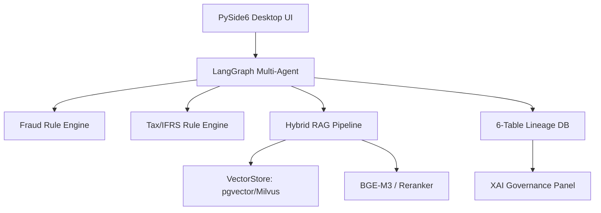

# ERP_RISK_MANAGE — Reliable AI Accounting & Audit Playground

[](https://opensource.org/licenses/MIT)
[](https://www.python.org/downloads/release/python-3110/)
[](https://github.com/langchain-ai/langgraph)

**"AI 가 만든 답을 사람이 검증할 수 있는가?"**에 대한 대답. 
ERP 의 정형 데이터와 법령·판례의 비정형 데이터를 결합하여, 모든 결정의 근거를 역추적(Lineage) 할 수 있는 신뢰할 수 있는 AI 회계·감사 에이전트 시스템입니다.

---

## 📺 Demo Scenarios

| 가공거래 탐지 및 통합 리스크 리포트 (Lineage XAI) | 수익인식 룰엔진 & 분개 자동 생성 |
|:---:|:---:|
|  |  |
| *부정 탐지 6개 패턴 + 통합 리스크 점수 산출* | *K-IFRS 1115 5단계 수익인식 로직 적용* |

> **더 많은 시나리오 확인:** [Demo Scenario Docs](docs/demo-scenarios.md)

---

## 🎯 Problem & Solution

### The Problem
*   **AI Blackbox:** AI 가 내놓은 리스크 진단 결과의 법적/회계적 근거를 알 수 없음.
*   **Rule vs LLM:** 룰 엔진의 경직성과 LLM 의 환각(Hallucination) 사이의 트레이드오프.
*   **Data Silos:** ERP 내 정형 데이터와 방대한 외부 법령 데이터의 파편화.

### Our Solution
1.  **Hybrid Architecture:** 344개의 테스트를 통과한 **정밀 룰 엔진**과 유연한 **RAG 기반 LLM**의 결합.
2.  **6-Table Lineage (XAI):** `audit_case → answer → rule_invocation / evidence_chunk` 로 이어지는 6단계 계층 구조로 AI 결정의 모든 근거를 데이터로 증명.
3.  **Multi-Agent Workflow:** LangGraph 를 이용한 `fraud → tax → rag → aggregate` 파이프라인으로 리스크를 다각도에서 분석.

---

## 🛠 Key Features

- **✅ 정밀 룰 엔진 (Deterministic Rules)**
  - **K-IFRS 1115:** 5단계 수익인식 파이프라인 (계약·의무·가격·배분·인식).
  - **세무/원천세:** 8개국 조세조약 기반 원천세 계산 및 VAT 룰.
  - **부정 탐지:** 벤포드 법칙(Benford's Law), 라운드 넘버, 중복 거래 등 6개 패턴 탐지.
- **🔍 하이브리드 검색 RAG**
  - **BGE-M3 Dense + Sparse Search:** 한국어 법령(15종) 및 합성 계약서 코퍼스 최적화 검색.
  - **Semantic Chunking:** 의미 단위 분할을 통한 검색 정확도 향상.
- **🏗 백엔드 추상화 (Backend Agnostic)**
  - `VectorStore` ABC 구현으로 **pgvector / Milvus / Pinecone** 을 환경변수 설정만으로 교체 가능.
- **📊 XAI & Governance**
  - **Lineage Tracking:** AI 답변의 소스 트랜잭션과 인용된 법령 청크를 1:1 매칭.
  - **Human-in-the-loop:** 신뢰도가 낮은 케이스를 자동으로 분류하는 검토 큐(Review Queue) 시스템.

---

## 🏗 Architecture



---

## 🚀 Quick Start

### 1. Infrastructure Setup (Docker)
```bash
# PostgreSQL(pgvector), Langfuse, vLLM, infinity-emb 실행
start_services.bat

# (Optional) Milvus 실행
docker compose -f deploy/milvus/docker-compose.yml up -d
```

### 2. Run Application
```bash
# PySide6 데스크톱 앱 실행
run.bat

# 시뮬레이션 CLI 실행
python scripts/run_simulation.py --n 20
```

---

## 📈 Evaluation Results

| Metric | Goal | Result | Status |
|---|---|---|---|
| **Fraud Recall** | ≥ 0.9 | **0.907** | ✅ Pass |
| **Ragas Faithfulness** | ≥ 0.85 | **1.000** | ✅ Pass |
| **Context Recall** | ≥ 0.85 | **0.833** | 🔄 Tuning |
| **Rule Engine Pass** | 100% | **344/344** | ✅ Pass |

---

## 📚 Technical Insights (Blog Series)

이 프로젝트의 프로토타입 구현부터 하이엔드 최적화까지의 전 과정은 **총 16편의 블로그 시리즈**로 기록되어 있습니다.

- **[RAG 최적화 연재 시리즈 전체 보기](https://southglory.github.io/tags/rag/)**
- **주요 여정:**
  - **시작:** "[RAG 연습 (1)] 법령 문서에 RAG를 직접 붙였다" — 기초 아키텍처 수립
  - **분석:** "같은 알고리즘이라도 백엔드(pgvector vs Milvus)에 따라 왜 결과가 다른가?"
  - **스케일업:** "50만 건 규모의 성능 측정 및 병목 지점 파악"
  - **워크플로우:** "멀티 에이전트 기반의 비동기 감사 시스템 설계"
  - **최적화:** "Semantic Chunking과 하이브리드 검색의 결합 전략"
  - **결말:** "[RAG 연습 (16)] 결국 Milvus 쓰면 되는 거 아닌가" — 시리즈의 결론 및 최종 스택 확정

---

## ⚖️ License
Distributed under the MIT License. See `LICENSE` for more information.
